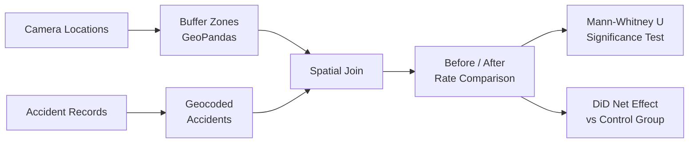

# Speed Camera Effectiveness Analysis — Interactive marimo Notebook

An interactive data analysis tool built with **[marimo](https://marimo.io/)** to
evaluate the effectiveness of speed cameras on provincial highways. This project
demonstrates how marimo's reactive notebook environment enables **interactive
stakeholder communication** — letting project managers and policymakers explore
analysis results hands-on, rather than reviewing static reports.

## Why marimo?

| Feature | Jupyter Notebook | marimo |
|---------|-----------------|--------|
| Execution model | Manual cell ordering | **Reactive** — change a parameter, all dependent cells update automatically |
| File format | JSON (`.ipynb`) | **Pure Python** (`.py`) — git-friendly, code-reviewable |
| Interactive UI | Requires ipywidgets setup | **Built-in** widgets (sliders, tables, buttons) |
| Reproducibility | Hidden state issues | **Guaranteed** — no stale cell outputs |
| Deployment | Needs Jupyter server | `marimo run` for app mode / `marimo export html` for static |

In this project, marimo enables:
- **Adjustable parameters** (buffer distance, analysis period) that reactively recompute all results
- **Clickable data tables** that trigger detail cards and spatial visualizations
- **Embedded interactive maps** (folium) showing camera locations and accident distributions
- **Dashboard-style summary cards** rendered as styled HTML within the notebook

## Quick Start

```bash
# Run the interactive notebook (uv will auto-install dependencies)
uv run marimo edit highway_rear_end_analysis.py

# Or run in app mode (read-only, ideal for presentations)
uv run marimo run highway_rear_end_analysis.py
```

> **Prerequisites**: [uv](https://docs.astral.sh/uv/) (recommended) or pip.
> No virtual environment setup needed — marimo's inline script metadata handles
> dependencies automatically.

## Project Structure

```
speed-camera-analysis-marimo/
├── highway_rear_end_analysis.py   # Main marimo notebook
├── data/
│   ├── cameras.csv                # Real speed camera locations (public data)
│   ├── accidents_demo.csv         # Synthetic accident records
│   └── sea_points.csv             # Camera exclusion list (bad coordinates)
├── scripts/
│   └── generate_demo_data.py      # Script to regenerate synthetic accidents
└── README.md
```

## Methodology



1. **Spatial Matching**: Create buffer zones around each camera → spatial join with accident records
2. **Temporal Segmentation**: Split accidents into pre-installation and post-installation periods
3. **Rate Comparison**: Monthly accident rate before vs. after camera installation
4. **Statistical Validation**: Mann-Whitney U test (non-parametric, p < 0.05)
5. **Control Group**: Difference-in-Differences using province-wide accident trends

## Tech Stack

- **[marimo](https://marimo.io/)** — Reactive Python notebook for interactive analysis
- **pandas** / **GeoPandas** — Data manipulation and spatial analysis
- **Shapely** — Geometric operations (buffer zones)
- **folium** — Interactive map visualization
- **SciPy** — Statistical testing (Mann-Whitney U)
- **matplotlib** / **seaborn** — Static chart visualization
- **uv** — Fast Python package manager with inline dependency support

## Data Note

- **Camera locations** (`data/cameras.csv`): Real public data from Pingtung County 
  government — speed camera installation sites are publicly disclosed information.
- **Accident records** (`data/accidents_demo.csv`): **Synthetic data** generated by 
  `scripts/generate_demo_data.py`. The data structure mirrors real government datasets 
  but all accident values are entirely fictional.

The analysis framework and interactive features are production-ready and have been used
for actual policy evaluation work.

## License

MIT

